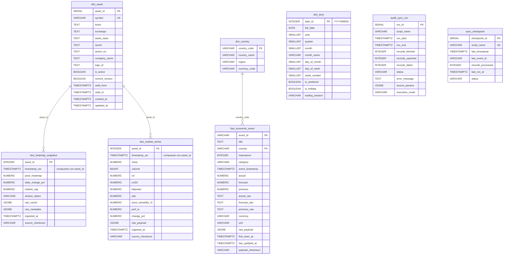

# Documentación de la Base de Datos `heatmap_stock`

> PostgreSQL 15+ — esquema star schema con particionamiento mensual por rango.

---

## Tabla de Contenidos

- [1. Resumen General](#1-resumen-general)
- [2. Diagrama Entidad-Relación](#2-diagrama-entidad-relación)
- [3. Tablas de Dimensiones](#3-tablas-de-dimensiones)
  - [3.1 dim_asset](#31-dim_asset)
  - [3.2 dim_country](#32-dim_country)
  - [3.3 dim_time](#33-dim_time)
- [4. Tablas de Hechos](#4-tablas-de-hechos)
  - [4.1 fact_heatmap_snapshot](#41-fact_heatmap_snapshot)
  - [4.2 fact_market_series](#42-fact_market_series)
  - [4.3 fact_economic_event](#43-fact_economic_event)
- [5. Tablas de Auditoría y Control](#5-tablas-de-auditoría-y-control)
  - [5.1 audit_sync_run](#51-audit_sync_run)
  - [5.2 sync_checkpoint](#52-sync_checkpoint)
- [6. Vistas Analíticas](#6-vistas-analíticas)
  - [6.1 vw_market_live](#61-vw_market_live)
  - [6.2 vw_heatmap_enriched](#62-vw_heatmap_enriched)
  - [6.3 vw_heatmap_event_impact](#63-vw_heatmap_event_impact)
- [7. Funciones PL/pgSQL](#7-funciones-plpgsql)
- [8. Índices](#8-índices)
- [9. Matriz de Estado](#9-matriz-de-estado)
- [10. Estrategia de Particionamiento](#10-estrategia-de-particionamiento)
- [11. Mapeo del Vector d[] (Endpoint TradingView)](#11-mapeo-del-vector-d-endpoint-tradingview)
- [12. Ejemplos de Queries Frecuentes](#12-ejemplos-de-queries-frecuentes)
- [13. Política de Retención](#13-política-de-retención)

---

## 1. Resumen General

| Propiedad | Valor |
|-----------|-------|
| **Nombre** | `heatmap_stock` |
| **Motor** | PostgreSQL 15+ |
| **Puerto** | `5432` |
| **Esquema** | `public` (star schema) |
| **Particionamiento** | Por rango (`timestamp_utc`) mensual en tablas de hechos |
| **Fuente principal** | Endpoint TradingView `/america/scan?label-product=heatmap-stock` |

### Arquitectura de datos

```
┌─────────────────────────────────────────────────────────────────┐
│                        FUENTES DE DATOS                         │
│                                                                 │
│   scrapper_heatmap_v1.py ──→ fact_heatmap_snapshot (activa)     │
│   scrapper_heatmap_v0.py ──→ fact_heatmap_snapshot (legacy)     │
│   [futuro] ───────────────→ fact_market_series (sin pipeline)   │
│   [futuro] ───────────────→ fact_economic_event (sin pipeline)  │
│                                                                 │
└─────────────────────────────────────────────────────────────────┘
         │
         ▼
┌─────────────────────────────────────────────────────────────────┐
│                     BASE DE DATOS heatmap_stock                 │
│                                                                 │
│  DIMENSIONES                HECHOS                               │
│  ┌──────────┐              ┌──────────────────────────┐          │
│  │ dim_asset │◄────────────│ fact_heatmap_snapshot     │          │
│  └──────────┘              │ (mensual, 4 métricas +   │          │
│  ┌──────────┐              │  2 JSONB)                 │          │
│  │dim_country│◄────────────│                           │          │
│  └──────────┘              │ fact_market_series        │          │
│  ┌──────────┐              │ (mensual, técnico)        │          │
│  │ dim_time  │◄────────────│                           │          │
│  └──────────┘              │ fact_economic_event       │          │
│                            └──────────────────────────┘          │
│  AUDITORÍA                 ┌────────────┐                        │
│  ┌──────────────┐          │ 3 vistas   │                        │
│  │audit_sync_run │          │ analíticas │                        │
│  ├──────────────┤          └────────────┘                        │
│  │sync_checkpoint│                                              │
│  └──────────────┘                                               │
└─────────────────────────────────────────────────────────────────┘
         │
         ▼
┌─────────────────────────────────────────────────────────────────┐
│                      APLICACIÓN CONSUMIDORA                     │
│  app.py (Streamlit) → heatmap_service.py → heatmap_repository.py│
└─────────────────────────────────────────────────────────────────┘
```

---

## 2. Diagrama Entidad-Relación



---

## 3. Tablas de Dimensiones

### 3.1 `dim_asset`

> Tabla de dimensiones tipo SCD (Slowly Changing Dimension) Tipo 2.
> Un registro por símbolo de activo. Versionado con `is_active` / `current_version`.

| Campo | Tipo | PK/FK | Nullable | Descripción |
|-------|------|-------|----------|-------------|
| `asset_id` | `SERIAL` | PK | NO | Identificador único autoincremental del activo |
| `symbol` | `VARCHAR(50)` | UK | NO | Símbolo completo: `"NASDAQ:NVDA"`, `"NYSE:AAPL"`. Constraint UNIQUE |
| `ticker` | `TEXT` | | NO | Ticker abreviado: `"NVDA"`, `"AAPL"` |
| `exchange` | `TEXT` | | NO | Bolsa de origen: `"NASDAQ"`, `"NYSE"`, `"ARCA"` |
| `asset_class` | `TEXT` | | | Tipo de activo: `"common"` (acción), `"etf"`, `"fund"`, `"structured"` |
| `sector` | `TEXT` | | | Sector industrial en inglés: `"Electronic Technology"`, `"Health Technology"`, `"Finance"` |
| `sector_es` | `TEXT` | | | Sector en español: `"Tecnología electrónica"` — usado solo por v0 del scrapper |
| `company_name` | `TEXT` | | | Nombre completo de la empresa: `"NVIDIA Corporation"` |
| `logo_id` | `TEXT` | | | ID del logo en TradingView, puede ser muy largo: `"digital-realty-trust-6993"` |
| `is_active` | `BOOLEAN` | | NO | `TRUE` = registro activo (SCD Tipo 2). Default: `TRUE` |
| `valid_from` | `TIMESTAMPTZ` | | NO | Timestamp de alta del registro. Default: `CURRENT_TIMESTAMP` |
| `valid_to` | `TIMESTAMPTZ` | | NO | Timestamp de baja. Default: `'infinity'` (abierto) |
| `current_version` | `BOOLEAN` | | NO | `TRUE` = versión vigente del registro. Default: `TRUE` |
| `created_at` | `TIMESTAMPTZ` | | NO | Timestamp de creación física del registro |
| `updated_at` | `TIMESTAMPTZ` | | NO | Timestamp de última actualización física |

**Índices:**
- `idx_dim_asset_active` — filtro parcial: `(is_active, current_version) WHERE is_active AND current_version`
- `idx_dim_asset_symbol` — búsqueda por `(symbol)`

**Escritura:**
- `scrapper_heatmap_v1.py` → `get_or_create_asset()` (INSERT ON CONFLICT DO UPDATE)
- `scrapper_heatmap_v0.py` → `get_or_create_asset()` (INSERT ON CONFLICT DO UPDATE)
- Funciones PL/pgSQL → auto-crean registro si symbol no existe

**Lectura:**
- `heatmap_repository.py` → JOIN con `fact_heatmap_snapshot` en todas las queries
- `heatmap_repository.py` → `get_sectors()` para filtro de UI

**Notas:**
- `company_name` y `ticker` vienen del mismo campo `d[25]` del endpoint (son idénticos)
- `sector_es` solo es poblado por el scrapper v0; el v1 ya no lo escribe

---

### 3.2 `dim_country`

> Dimensiones de países para el calendario económico. Fuente: datos estáticos.

| Campo | Tipo | PK/FK | Nullable | Descripción |
|-------|------|-------|----------|-------------|
| `country_code` | `VARCHAR(5)` | PK | NO | Código ISO del país: `"US"`, `"DE"`, `"JP"` |
| `country_name` | `VARCHAR(100)` | | | Nombre del país: `"United States"`, `"Germany"` |
| `region` | `VARCHAR(50)` | | | Región geográfica: `"Americas"`, `"Europe"`, `"Asia"` |
| `currency_code` | `VARCHAR(5)` | | | Código de moneda: `"USD"`, `"EUR"`, `"JPY"` |

**Escritura:** Ningún script actual inserta datos. Tabla definida para futuro pipeline de calendario económico.
**Lectura:** Referenciada por la vista `vw_heatmap_event_impact` (subquery por `currency_code = 'USD'`).

---

### 3.3 `dim_time`

> Dimensión temporal para análisis avanzado. Tabla de calendario generado.

| Campo | Tipo | PK/FK | Nullable | Descripción |
|-------|------|-------|----------|-------------|
| `date_id` | `INTEGER` | PK | NO | Formato `YYYYMMDD` (ej: `20260911`) |
| `full_date` | `DATE` | | NO | Fecha completa: `2026-09-11` |
| `year` | `SMALLINT` | | NO | Año: `2026` |
| `quarter` | `SMALLINT` | | NO | Trimestre: `3` |
| `month` | `SMALLINT` | | NO | Mes: `9` |
| `month_name` | `VARCHAR(20)` | | | Nombre del mes: `"September"` |
| `day_of_month` | `SMALLINT` | | NO | Día del mes: `11` |
| `day_of_week` | `SMALLINT` | | NO | Día de la semana: `1`=Lunes, `7`=Domingo |
| `week_number` | `SMALLINT` | | NO | Número de semana ISO |
| `is_weekend` | `BOOLEAN` | | NO | `TRUE` si es sábado o domingo |
| `is_holiday` | `BOOLEAN` | | NO | `TRUE` si es feriado de mercado |
| `trading_session` | `VARCHAR(20)` | | | Sesión de mercado: `"US"`, `"EU"`, `"ASIA"` |

**Escritura:** Ningún script actual.
**Lectura:** Ninguna query actual.

---

## 4. Tablas de Hechos

### 4.1 `fact_heatmap_snapshot`

> Snapshot del heatmap de TradingView. Cada ejecución del scrapper guarda el estado de los **top 1000 stocks** por market cap.
> **Particionada mensualmente** por `timestamp_utc`.

| Campo | Tipo | PK/FK | Nullable | Descripción |
|-------|------|-------|----------|-------------|
| `asset_id` | `INTEGER` | PK, FK | NO | Referencia a `dim_asset(asset_id)` |
| `timestamp_utc` | `TIMESTAMPTZ` | PK | NO | Timestamp UTC del snapshot. Compuesto con `asset_id` como PK |
| `price_heatmap` | `NUMERIC(18,6)` | | | Precio de cierre actual del activo. Redondeado a 4 decimales. **Renombrado de `price` → `price_heatmap`** para identificar la fuente cuando la BD sea compartida con otras apps |
| `daily_change_pct` | `NUMERIC(12,6)` | | | Cambio porcentual diario (ej: `2.35` = +2.35%). Redondeado a 4 decimales |
| `market_cap` | `NUMERIC(18,0)` | | | Capitalización de mercado en USD (ej: `5270000000000` = $5.27T). Redondeado a 2 decimales |
| `stream_status` | `VARCHAR(30)` | | | Estado del stream: `"streaming_900"`, `"delayed_streaming_900"`, `"endofday"` |
| `raw_vector` | `JSONB` | | | Vector `d[]` completo de 28 campos (ver [Mapeo d[]](#11-mapeo-del-vector-d-endpoint-tradingview)). Permite consultas futuras sin volver al endpoint |
| `raw_metadata` | `JSONB` | | | Metadata parseada: `{"asset_class": "common", "sector": "...", "company_name": "...", "logo": {...}, "ticker": "..."}` |
| `ingested_at` | `TIMESTAMPTZ` | | NO | Timestamp de inserción automática (`CURRENT_TIMESTAMP`) |
| `source_checksum` | `VARCHAR(64)` | | | Checksum del payload fuente (para detectar cambios) |

**Particiones actuales:**
```
fact_heatmap_snapshot_2026_09  (septiembre 2026)
fact_heatmap_snapshot_2026_10  (octubre 2026)
fact_heatmap_snapshot_2026_11  (noviembre 2026)
fact_heatmap_snapshot_2026_12  (diciembre 2026)
```

**Escritura:**
- `scrapper_heatmap_v1.py` → `process_heatmap_data()` via `psycopg2.extras.execute_values()` (batch UPSERT)
- `scrapper_heatmap_v0.py` → `process_heatmap_data()` via `psycopg2.extras.execute_values()` (legacy)

**Lectura:**
- `heatmap_repository.py` → `get_heatmap_last_hour()` — último snapshot por activo en la última hora
- `heatmap_repository.py` → `get_heatmap_stats()` — métricas agregadas (promedios, contadores)
- `heatmap_repository.py` → `get_price_evolution()` — evolución de precios (últimos 6 snapshots, 1h)

**Frecuencia de escritura:** Cada 5 minutos via cron (documentado, no instalado).

---

### 4.2 `fact_market_series`

> Series temporales de indicadores técnicos. **Tabla definida pero sin pipeline de datos actualmente.**

| Campo | Tipo | PK/FK | Nullable | Descripción |
|-------|------|-------|----------|-------------|
| `asset_id` | `INTEGER` | PK, FK | NO | Referencia a `dim_asset(asset_id)` |
| `timestamp_utc` | `TIMESTAMPTZ` | PK | NO | Timestamp UTC de la observación |
| `close` | `NUMERIC(18,6)` | | | Precio de cierre |
| `volume` | `BIGINT` | | | Volumen negociado |
| `rsi` | `NUMERIC(10,4)` | | | Índice de Fuerza Relativa (14 períodos) |
| `cci20` | `NUMERIC(10,4)` | | | Commodity Channel Index (20 períodos) |
| `bbpower` | `NUMERIC(10,4)` | | | Bull Bear Power |
| `adx` | `NUMERIC(10,4)` | | | Average Directional Index |
| `pivot_camarilla_r3` | `NUMERIC(18,6)` | | | Pivot Camarilla R3 |
| `perf_w` | `NUMERIC(10,4)` | | | Performance semanal |
| `change_pct` | `NUMERIC(10,4)` | | | Cambio porcentual |
| `raw_payload` | `JSONB` | | | Payload completo original de la API |
| `ingested_at` | `TIMESTAMPTZ` | | NO | Timestamp de inserción |
| `source_checksum` | `VARCHAR(64)` | | | Checksum para detectar cambios |

**Escritura:** Ningún script actual inserta datos.
**Lectura:** Ninguna query actual. La vista `vw_market_live` y `vw_heatmap_enriched` la referencian.

---

### 4.3 `fact_economic_event`

> Calendario económico. **Tabla definida pero sin pipeline de datos actualmente.**

| Campo | Tipo | PK/FK | Nullable | Descripción |
|-------|------|-------|----------|-------------|
| `event_id` | `VARCHAR(100)` | PK | NO | ID del evento: `"us-nonfarm-payrolls-20260905"` |
| `title` | `TEXT` | | | Título del evento: `"Non-Farm Payrolls"` |
| `country` | `VARCHAR(5)` | FK | | Código de país → `dim_country(country_code)` |
| `importance` | `INTEGER` | | | Importancia: `1`=Alta, `2`=Media, `3`=Baja |
| `category` | `VARCHAR(100)` | | | Categoría: `"Employment"`, `"Inflation"`, `"GDP"` |
| `event_timestamp` | `TIMESTAMPTZ` | | NO | Fecha/hora programada del evento |
| `actual` | `NUMERIC(18,6)` | | | Valor actual (cuando se publica) |
| `forecast` | `NUMERIC(18,6)` | | | Valor estimado por consenso |
| `previous` | `NUMERIC(18,6)` | | | Valor del período anterior |
| `actual_raw` | `TEXT` | | | Valor actual en texto original: `"1.2M"`, `"$50.5B"` |
| `forecast_raw` | `TEXT` | | | Valor estimado en texto original |
| `previous_raw` | `TEXT` | | | Valor anterior en texto original |
| `currency` | `VARCHAR(5)` | | | Moneda del reporte: `"USD"`, `"EUR"` |
| `unit` | `VARCHAR(20)` | | | Unidad de medida: `"Percent"`, `"Million"`, `"Billion"` |
| `raw_payload` | `JSONB` | | NO | Payload completo de la API económica |
| `first_seen_at` | `TIMESTAMPTZ` | | NO | Primera vez que se vio este evento |
| `last_updated_at` | `TIMESTAMPTZ` | | NO | Última actualización (cambio forecast→actual) |
| `payload_checksum` | `VARCHAR(64)` | | | Checksum del payload para detectar cambios |

**Escritura:** Ningún script actual.
**Lectura:** Referenciada por `vw_heatmap_event_impact` (LEFT JOIN).

---

## 5. Tablas de Auditoría y Control

### 5.1 `audit_sync_run`

> Registro de cada ejecución de los scripts de ingesta. Permite trazabilidad y debugging.

| Campo | Tipo | PK/FK | Nullable | Descripción |
|-------|------|-------|----------|-------------|
| `run_id` | `SERIAL` | PK | NO | ID secuencial de la ejecución |
| `script_name` | `VARCHAR(100)` | | NO | Nombre del script: `"scrapper_heatmap_v1"` |
| `run_start` | `TIMESTAMPTZ` | | NO | Timestamp de inicio de la ejecución |
| `run_end` | `TIMESTAMPTZ` | | | Timestamp de fin de la ejecución |
| `records_fetched` | `INTEGER` | | NO | Registros obtenidos del endpoint. Default: `0` |
| `records_upserted` | `INTEGER` | | NO | Registros insertados/actualizados exitosamente en BD |
| `records_failed` | `INTEGER` | | NO | Registros fallidos: `fetched - upserted` |
| `status` | `VARCHAR(20)` | | NO | Estado: `"RUNNING"`, `"SUCCESS"`, `"PARTIAL_FAIL"`, `"FAILED"` |
| `error_message` | `TEXT` | | | Mensaje de error (si aplica) |
| `source_params` | `JSONB` | | | Parámetros usados en la ejecución |
| `execution_mode` | `VARCHAR(30)` | | | Modo: `"cron"`, `"manual"`, `"backfill"` |

**Escritura:** Solo `scrapper_heatmap_v1.py` → `log_sync_run()` (3 puntos: inicio fallido, éxito, excepción).
**Lectura:** Queries manuales de auditoría (ver [Ejemplos](#12-ejemplos-de-queries-frecuentes)).

---

### 5.2 `sync_checkpoint`

> Checkpoints para reanudación de backfills. **Tabla definida sin uso actual.**

| Campo | Tipo | PK/FK | Nullable | Descripción |
|-------|------|-------|----------|-------------|
| `checkpoint_id` | `SERIAL` | PK | NO | ID del checkpoint |
| `script_name` | `VARCHAR(100)` | UK | NO | Nombre del script (constraint UNIQUE) |
| `last_timestamp` | `TIMESTAMPTZ` | | NO | Último timestamp procesado con éxito |
| `last_event_id` | `VARCHAR(100)` | | | Último event_id procesado (para calendario) |
| `records_processed` | `INTEGER` | | NO | Total de registros procesados desde este checkpoint |
| `last_run_at` | `TIMESTAMPTZ` | | NO | Última ejecución del script |
| `status` | `VARCHAR(20)` | | NO | Estado: `"ACTIVE"`, `"PAUSED"`, `"COMPLETED"` |

**Escritura:** Ningún script actual.
**Lectura:** Ninguna query actual.

---

## 6. Vistas Analíticas

### 6.1 `vw_market_live`

> Unión de series temporales con activos activos. Filtro: últimos 7 días.

**Tablas involucradas:** `fact_market_series` + `dim_asset`
**Columnas calculadas:** `signal_status` (OVERSOLD_REVERSAL / OVERBOUGHT_REVERSAL / NEUTRAL / TRENDING)

**Estado:** Definida, sin datos (fact_market_series vacía).

---

### 6.2 `vw_heatmap_enriched`

> Heatmap enriquecido con métricas técnicas y dirección del mercado.

**Tablas involucradas:** `fact_heatmap_snapshot` + `dim_asset` (subquery a `fact_market_series` para `last_rsi`)
**Columnas calculadas:**
- `market_direction`: `"BUY"` (positivo), `"SELL"` (negativo), `"NEUTRAL"` (cero)
- `color_intensity`: valor absoluto del cambio porcentual (para escala de color en dashboards)
- `last_rsi`: último RSI disponible del activo (si `fact_market_series` tuviera datos)

**Estado:** Definida, funciona (pero `last_rsi` siempre NULL por falta de datos en `fact_market_series`).

---

### 6.3 `vw_heatmap_event_impact`

> Cruce heatmap + eventos económicos para analizar impacto de noticias en movimientos de precio.

**Tablas involucradas:** `vw_heatmap_enriched` + `fact_economic_event` + `dim_country`
**Columnas calculadas:** `hours_since_event` (horas entre el snapshot y el evento)
**Filtro:** Solo eventos con importancia ≤ 2 (alta/media) y ventana de ±6 horas.

**Estado:** Definida, sin datos (fact_economic_event vacía).

---

## 7. Funciones PL/pgSQL

### `text_to_tsvector_english(input_text TEXT)`

> Wrapper inmutable para búsquedas de texto completo en inglés.

```sql
SELECT to_tsvector('english', COALESCE(input_text, ''));
```

Usado por el índice GIN en `fact_economic_event.title`.

---

### `upsert_heatmap_snapshot(...)`

> UPSERT de un snapshot del heatmap por símbolo. Auto-crea el activo en `dim_asset` si no existe.

```sql
SELECT upsert_heatmap_snapshot(
    p_symbol           VARCHAR,      -- "NASDAQ:NVDA"
    p_timestamp_utc    TIMESTAMPTZ,  -- UTC del snapshot
    p_price_heatmap    NUMERIC,      -- Precio de cierre
    p_daily_change_pct NUMERIC,      -- Cambio % diario
    p_market_cap       NUMERIC,      -- Market cap en USD
    p_stream_status    VARCHAR,      -- Estado del stream
    p_raw_vector       JSONB,        -- Vector d[] completo
    p_raw_metadata     JSONB         -- Metadata parseada
);
```

**Nota:** Los scrappers NO usan esta función — implementan la lógica UPSERT inline con batch `execute_values()` por rendimiento.

---

### `upsert_market_series(...)`

> UPSERT de series temporales de indicadores técnicos.

```sql
SELECT upsert_market_series(
    p_asset_symbol VARCHAR,      -- "NASDAQ:NVDA"
    p_timestamp_utc TIMESTAMPTZ,
    p_close NUMERIC, p_volume BIGINT,
    p_rsi NUMERIC, p_cci20 NUMERIC, p_bbpower NUMERIC, p_adx NUMERIC,
    p_pivot_camarilla_r3 NUMERIC, p_perf_w NUMERIC, p_change_pct NUMERIC,
    p_raw_payload JSONB
);
```

**Estado:** Definida, sin uso actual.

---

## 8. Índices

### `dim_asset`

| Índice | Columnas | Tipo | Nota |
|--------|----------|------|------|
| `pk_dim_asset` | `asset_id` | B-tree (PK) | Auto (SERIAL) |
| `dim_asset_symbol_key` | `symbol` | B-tree (UK) | UNIQUE |
| `idx_dim_asset_active` | `(is_active, current_version)` | B-tree parcial | WHERE `is_active AND current_version` |
| `idx_dim_asset_symbol` | `symbol` | B-tree | Búsqueda rápida |

### `fact_heatmap_snapshot`

| Índice | Columnas | Tipo | Nota |
|--------|----------|------|------|
| `pk_fact_heatmap_snapshot` | `(asset_id, timestamp_utc)` | B-tree (PK) | Compuesto |
| `idx_fact_heatmap_ts_desc` | `timestamp_utc DESC` | B-tree | Para queries temporales |
| `idx_fact_heatmap_mcap` | `market_cap DESC` | B-tree parcial | WHERE `market_cap IS NOT NULL` |
| `idx_fact_heatmap_change` | `daily_change_pct` | B-tree parcial | WHERE `daily_change_pct IS NOT NULL` |
| `idx_fact_heatmap_raw_vector` | `raw_vector` | GIN | Para búsquedas dentro del JSONB |

### `fact_market_series`

| Índice | Columnas | Tipo | Nota |
|--------|----------|------|------|
| `pk_fact_market_series` | `(asset_id, timestamp_utc)` | B-tree (PK) | Compuesto |
| `idx_fact_market_series_ts_desc` | `timestamp_utc DESC` | B-tree | Para queries temporales |
| `idx_fact_market_series_rsi` | `rsi` | B-tree parcial | WHERE `rsi IS NOT NULL` |
| `idx_fact_market_series_close` | `close` | B-tree parcial | WHERE `close IS NOT NULL` |
| `idx_fact_market_series_date` | `CAST(timestamp_utc AT TIME ZONE 'UTC' AS date)` | B-tree | Por fecha |

### `fact_economic_event`

| Índice | Columnas | Tipo | Nota |
|--------|----------|------|------|
| `pk_fact_economic_event` | `event_id` | B-tree (PK) | |
| `idx_fact_economic_event_ts` | `event_timestamp DESC` | B-tree | |
| `idx_fact_economic_event_country` | `country` | B-tree | |
| `idx_fact_economic_event_importance` | `importance` | B-tree parcial | WHERE `importance <= 2` |
| `idx_fact_economic_event_title_gin` | `text_to_tsvector_english(title)` | GIN | Búsqueda de texto completo |

### `audit_sync_run`

| Índice | Columnas | Tipo | Nota |
|--------|----------|------|------|
| `pk_audit_sync_run` | `run_id` | B-tree (PK) | Auto (SERIAL) |
| `idx_audit_sync_run_script` | `(script_name, run_start DESC)` | B-tree | Histórico por script |

---

## 9. Matriz de Estado

| Tabla | Escritura | Lectura | Datos | Estado |
|-------|-----------|---------|-------|--------|
| `dim_asset` | scrapper_heatmap_v0.py, scrapper_heatmap_v1.py, PL/pgSQL (auto) | heatmap_repository.py | ✓ | **ACTIVA** |
| `fact_heatmap_snapshot` | scrapper_heatmap_v0.py, scrapper_heatmap_v1.py | heatmap_repository.py, 03_comprobar.sql | ✓ | **ACTIVA** |
| `fact_market_series` | — | — | ✗ | **DEFINIDA SIN PIPELINE** |
| `fact_economic_event` | — | — | ✗ | **DEFINIDA SIN PIPELINE** |
| `dim_country` | — | vw_heatmap_event_impact | ✗ | **DEFINIDA SIN PIPELINE** |
| `dim_time` | — | — | ✗ | **DEFINIDA SIN PIPELINE** |
| `audit_sync_run` | scrapper_heatmap_v1.py | queries manuales | ✓ | **ACTIVA** (solo v1) |
| `sync_checkpoint` | — | — | ✗ | **DEFINIDA SIN PIPELINE** |

| Vista | Datos | Estado |
|-------|-------|--------|
| `vw_market_live` | ✗ | DEFINIDA SIN PIPELINE |
| `vw_heatmap_enriched` | parcial | DEFINIDA (last_rsi siempre NULL) |
| `vw_heatmap_event_impact` | ✗ | DEFINIDA SIN PIPELINE |

| Función | Uso real | Estado |
|---------|----------|--------|
| `text_to_tsvector_english()` | Índice GIN (solo si hubiera datos) | DEFINIDA |
| `upsert_heatmap_snapshot()` | No usada por scrappers (usan batch inline) | DEFINIDA SIN USO |
| `upsert_market_series()` | No usada por ningún script | DEFINIDA SIN USO |

---

## 10. Estrategia de Particionamiento

Las tablas de hechos (`fact_heatmap_snapshot`, `fact_market_series`) usan **particionamiento por rango** en `timestamp_utc` con particiones mensuales.

### Creación de particiones

- **Automática por el scrapper:** `scrapper_heatmap_v1.py` crea la partición del mes actual antes de insertar.
- **Script dedicado:** `create_partitions.py` crea particiones para N meses futuros (default: 3).

### Convención de nombres

```
fact_heatmap_snapshot_YYYY_MM
fact_market_series_YYYY_MM
```

### Ejemplo

```sql
-- Partición para septiembre 2026
CREATE TABLE fact_heatmap_snapshot_2026_09
    PARTITION OF fact_heatmap_snapshot
    FOR VALUES FROM ('2026-09-01') TO ('2026-10-01');
```

### Verificar particiones

```sql
SELECT
    child.relname AS partition_name,
    pg_get_expr(child.relpartbound, child.oid) AS partition_range
FROM pg_inherits
JOIN pg_class parent ON pg_inherits.inhparent = parent.oid
JOIN pg_class child  ON pg_inherits.inhrelid = child.oid
JOIN pg_namespace n ON n.oid = parent.relnamespace
WHERE parent.relname = 'fact_heatmap_snapshot'
  AND n.nspname = 'public'
ORDER BY child.relname;
```

---

## 11. Mapeo del Vector d[] (Endpoint TradingView)

Cada activo del endpoint devuelve un vector `d[]` de **28 elementos**. El scrapper mapea los campos relevantes:

| Índice | Campo | Tipo | Uso en la BD | Redondeo |
|--------|-------|------|-------------|----------|
| `d[0]` | typespecs | array | → `dim_asset.asset_class` (primer elemento) | — |
| `d[1]` | change | float | → `fact_heatmap_snapshot.daily_change_pct` | 4 decimales |
| `d[2]` | change_abs | float | Guardado en `raw_vector` | 4 decimales |
| `d[3]` | Perf.1M | float | Guardado en `raw_vector` | 4 decimales |
| `d[4]` | Perf.3M | float | Guardado en `raw_vector` | 4 decimales |
| `d[5]` | Perf.6M | float | Guardado en `raw_vector` | 4 decimales |
| `d[6]` | Perf.Y | float | Guardado en `raw_vector` | 4 decimales |
| `d[7]` | Perf.YTD | float | Guardado en `raw_vector` | 4 decimales |
| `d[8]` | Volatility.D | float | Guardado en `raw_vector` | 4 decimales |
| `d[9]` | price_52_week_high | float | Guardado en `raw_vector` | 4 decimales |
| `d[10]` | price_52_week_low | float | Guardado en `raw_vector` | 4 decimales |
| `d[11]` | market_cap_basic | float | → `fact_heatmap_snapshot.market_cap` | 2 decimales |
| `d[12]` | average_volume_30d_calc | float | Guardado en `raw_vector` | 4 decimales |
| `d[13]` | average_volume_10d_calc | float | Guardado en `raw_vector` | 4 decimales |
| `d[14]` | volume | float | Guardado en `raw_vector` | 4 decimales |
| `d[15]` | total_shares_outstanding | float | Guardado en `raw_vector` | 4 decimales |
| `d[16]` | total_shares_outstanding_fundamental | float | Guardado en `raw_vector` | 4 decimales |
| `d[17]` | number_of_employees | float | Guardado en `raw_vector` | 4 decimales |
| `d[18]` | earnings_per_share_basic_ttm | float | Guardado en `raw_vector` | 4 decimales |
| `d[19]` | revenue_per_employee_ttm | float | Guardado en `raw_vector` | 4 decimales |
| `d[20]` | gross_profit_1Y_growth_fq | float | Guardado en `raw_vector` | 4 decimales |
| `d[21]` | sector | string | → `dim_asset.sector` | — |
| `d[22]` | logoid | object | → `dim_asset.logo_id` (campo `logoid` del dict) | — |
| `d[23]` | close | float | → `fact_heatmap_snapshot.price_heatmap` | 4 decimales |
| `d[24]` | pricescale | float | Guardado en `raw_vector` | — |
| `d[25]` | name | string | → `dim_asset.ticker` y `dim_asset.company_name` | — |
| `d[26]` | update_mode | string | → `fact_heatmap_snapshot.stream_status` | — |
| `d[27]` | currency | string | Guardado en `raw_vector` | — |

---

## 12. Ejemplos de Queries Frecuentes

### Último snapshot por activo (última hora)

```sql
SELECT
    a.symbol, a.ticker, a.sector, a.company_name,
    h.price_heatmap, h.daily_change_pct, h.market_cap, h.timestamp_utc
FROM (
    SELECT DISTINCT ON (a.symbol)
        a.symbol, a.ticker, a.sector, a.company_name,
        h.price_heatmap, h.daily_change_pct, h.market_cap, h.timestamp_utc
    FROM fact_heatmap_snapshot h
    JOIN dim_asset a ON h.asset_id = a.asset_id
    WHERE h.timestamp_utc >= NOW() - INTERVAL '1 hour'
      AND a.is_active = TRUE
      AND a.current_version = TRUE
    ORDER BY a.symbol, h.timestamp_utc DESC
) latest
ORDER BY market_cap DESC NULLS LAST;
```

### Evolución de precios (últimos 6 snapshots, 1 hora)

```sql
WITH ranked AS (
    SELECT
        a.symbol, a.ticker, a.sector, a.company_name,
        h.price_heatmap, h.daily_change_pct, h.market_cap, h.timestamp_utc,
        ROW_NUMBER() OVER (
            PARTITION BY a.symbol
            ORDER BY h.timestamp_utc DESC
        ) AS rn
    FROM fact_heatmap_snapshot h
    JOIN dim_asset a ON h.asset_id = a.asset_id
    WHERE h.timestamp_utc >= NOW() - make_interval(hours => 1)
      AND a.is_active = TRUE
      AND a.current_version = TRUE
)
SELECT symbol, ticker, sector, company_name,
       price_heatmap, daily_change_pct, market_cap, timestamp_utc, rn
FROM ranked
WHERE rn <= 6
ORDER BY market_cap DESC NULLS LAST, symbol, rn;
```

### Estadísticas del heatmap

```sql
SELECT
    COUNT(*) AS total_stocks,
    COUNT(*) FILTER (WHERE daily_change_pct > 0) AS stocks_up,
    COUNT(*) FILTER (WHERE daily_change_pct < 0) AS stocks_down,
    COUNT(*) FILTER (WHERE daily_change_pct = 0) AS stocks_neutral,
    ROUND(AVG(price_heatmap)::numeric, 2) AS avg_price,
    ROUND(AVG(daily_change_pct)::numeric, 4) AS avg_change_pct
FROM (
    SELECT DISTINCT ON (a.symbol)
        h.price_heatmap, h.daily_change_pct
    FROM fact_heatmap_snapshot h
    JOIN dim_asset a ON h.asset_id = a.asset_id
    WHERE h.timestamp_utc >= NOW() - INTERVAL '1 hour'
      AND a.is_active = TRUE
      AND a.current_version = TRUE
    ORDER BY a.symbol, h.timestamp_utc DESC
) latest;
```

### Consultar auditoría

```sql
SELECT run_id, script_name, run_start, run_end,
       records_fetched, records_upserted, status, error_message
FROM audit_sync_run
ORDER BY run_start DESC
LIMIT 10;
```

---

## 13. Política de Retención

| Elemento | Retención | Mecanismo |
|----------|-----------|-----------|
| Datos `fact_heatmap_snapshot` | **Sin límite** — se conservan todos los snapshots históricos | No hay DELETE programado |
| Logs de la app (`LOGS/`) | **14 días** | `TimedRotatingFileHandler` con `backupCount=14`, rotación nocturna |
| Logs de cron (`logs/cron_heatmap.log`) | **Sin límite** | Sin rotación programada (manual o por OS) |
| Particiones | **Se crean 3 meses adelante** | `create_partitions.py` |

---

*Documento generado el 2026-09-11. Fuente: `scripts/02_init_database.sql` + análisis de código.*
